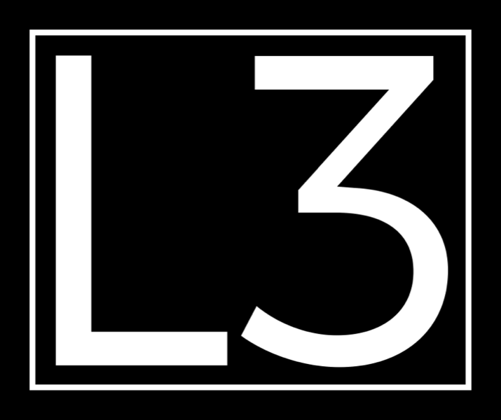
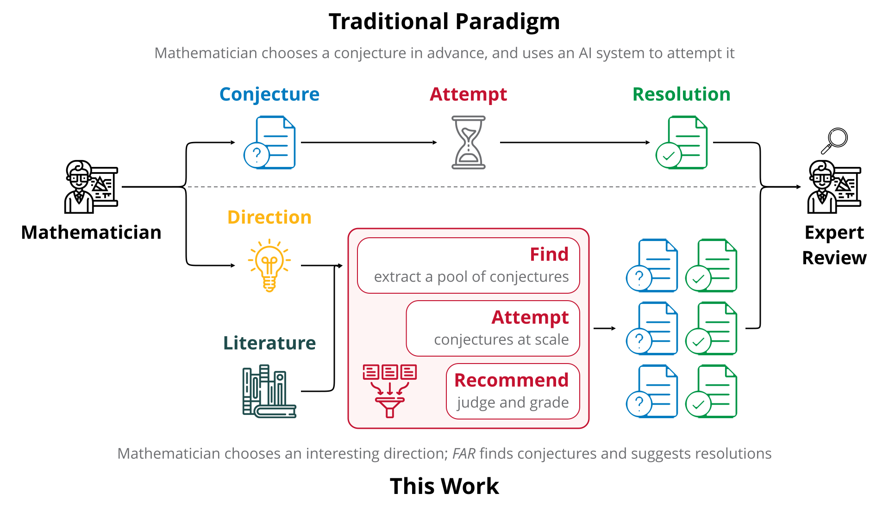
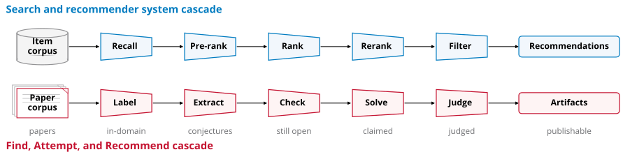

<!-- markdownlint-disable first-line-h1 -->
<!-- markdownlint-disable html -->
<!-- markdownlint-disable no-duplicate-header -->

<div align="center">
  <a href="https://www.cmu.edu"></a>
  &nbsp;&nbsp;&nbsp;&nbsp;&nbsp;&nbsp;&nbsp;&nbsp;
  <a href="https://cmu-l3.github.io"></a>
  &nbsp;&nbsp;&nbsp;&nbsp;&nbsp;&nbsp;&nbsp;&nbsp;
  <a href="https://anysphere.inc"></a>
</div>

<hr>

<h1 align="center" style="font-weight: bold; border-bottom: none; margin-bottom: 0;">
FAR: Find, Attempt, and Recommend
</h1>

<div align="center" style="line-height: 1;">
  <a href="https://arxiv.org/abs/2608.16977"></a>
  <a href="https://probxiv.com"></a>
  <a href="LICENSE"></a>
</div>

<p align="center">
  <a href="#overview">Overview</a> |
  <a href="#the-cascade">The Cascade</a> |
  <a href="#data-preparation">Data Preparation</a> |
  <a href="#setup">Setup</a> |
  <a href="#running">Running</a> |
  <a href="#citation">Citation</a>
</p>

**FAR** is a literature-to-review cascade. Given a large literature corpus and a
research direction, FAR finds relevant open conjectures, attempts to prove or
disprove them, and recommends promising conjecture-resolution pairs for expert
review. The pipeline has three stages:

- **Find** — label which papers lie in the direction, extract unresolved
  statements from them, and check which are well posed and still open.
- **Attempt** — search for resolutions across the extracted conjecture pool,
  with each attempt yielding either a claimed resolution or no result.
- **Recommend** — judge each claimed resolution for correctness, grade it for
  significance, and put forward those worthy of expert review.

## Overview

Frontier-model reasoning is a limited resource, and expert mathematical review is
scarcer still. In most existing AI-for-math workflows, human effort is
concentrated at the two ends: choosing a problem worth attempting, and reviewing
the resulting model outputs.
FAR replaces the first with a *research direction* and compresses the second with
an automated triage cascade.

<div align="center">
  
  <p>Figure: <em>The upper part is the problem-level interface used by most AI-for-math workflows; the lower part is ours — the mathematician supplies a direction, and FAR supplies the problems and candidate resolutions.</em></p>
</div>

## The Cascade

Inspired by search and recommender systems, FAR narrows a large collection through
progressively more expensive stages, so later stages can afford more compute per
item.

<div align="center">
  
  <p>Figure: <em>Upper row, a search or recommender cascade. Lower row, the analogous FAR pipeline.</em></p>
</div>

```
       corpus
         │
  Find   ├─ label ────── does this paper lie in the research direction?
         ├─ extract ──── recover explicit unresolved statements
         └─ check ────── open / solved / invalid  ────────────────►  pool P
         │
Attempt  └─ solve ────── one attempt per conjecture: KNOWN / NEW / FIX / NONE
         │
Recomm.  ├─ judge ────── is the claimed resolution correct?  PASS / FAIL / KNOWN
         └─ grade ────── how significant?  KNOWN / TYPE1 / TYPE2 / TYPE3  ──►  artifacts A
```

`TYPE2` and `TYPE3` results form the artifact set put forward for expert review.

### Stage names

The code uses the names from the paper.

| Paper | Module | Output |
|---|---|---|
| Find, "Finding relevant papers via labeling" | `src/label.py` | `data/labeled.jsonl` |
| Find, "Extracting and recovering conjectures" | `src/extract.py` | `data/extracted.jsonl` |
| Find, "Checking validity and status" | `src/check.py` | `data/checked.jsonl` |
| Attempt, "Attempting for Candidate Resolutions" | `src/solve.py` | `data/solved.jsonl` |
| Recommend, "Judging" | `src/judge.py` | `data/judged.jsonl` |
| Recommend, "Recommending for review" | `src/grade.py` | `data/graded.jsonl` |

Prompts for all six are in `src/prompts.py`, in pipeline order, matching
appendix A of the paper. Output schemas and validators are in `src/schemas.py`.

### The research direction

Label takes a free-text direction and answers a single yes/no per paper, so the
granularity is yours to set:

```bash
--direction "combinatorics"
--direction "extremal graph theory"
--direction "additive number theory over function fields"
```

## Data Preparation

FAR reads one input: a corpus of paper text, stored as one Arrow IPC file
(`.arrow`) with a `text` column, one paper per row. By default, the scripts
read `data/raw/corpus.arrow`. To use another path, set `CORPUS` at the top of
the script you are running, or pass it directly:

```bash
python src/pipeline.py --stage all --corpus /path/to/corpus.arrow
```

## Setup

Please use Python 3.10 or newer. You can create a conda environment for FAR by
running:

```bash
conda create -n far python=3.12 -y
conda activate far
pip install -r requirements.txt
```

The API keys and endpoints are read from environment variables. `~/.env` is also
loaded automatically, so you can keep the variables there instead of exporting
them. Each of the three Find stages takes its own pair, so they can run on
different providers:

```bash
export LABEL_API_KEY=...      LABEL_BASE_URL=...
export EXTRACT_API_KEY=...    EXTRACT_BASE_URL=...
export CHECK_API_KEY=...      CHECK_BASE_URL=...
```

Solve, Judge, and Grade run through the [`opencode`](https://opencode.ai) CLI,
which manages its own credentials.
Install it using the [official instructions](https://opencode.ai/download) and
ensure it is on `PATH`. It can be replaced by any other agent backbone — Codex,
Claude Code, Cursor — by editing `src/agent.py`.

## Running

The four scripts in `scripts/` cover the three phases and the whole pipeline.
You can run them from the repository root:

```bash
bash scripts/run_all.sh      # everything, streamed -> run_all.log
bash scripts/find.sh         # label -> extract -> check -> find.log
bash scripts/attempt.sh      # solve -> attempt.log
bash scripts/recommend.sh    # judge -> grade -> recommend.log
```

You can also run a single stage against an earlier stage's output:

```bash
python src/pipeline.py --stage check --input data/extracted.jsonl
python src/pipeline.py --stage grade --input data/judged.jsonl
```

Common flags are `--direction` for the research direction, `--limit N` for a
trial on a few rows, `--resume true` to continue an interrupted run, `--judges N`
for independent judge passes per solution, and `--<stage>-jobs` for concurrency.
`python src/pipeline.py --help` lists all of them.

The defaults reproduce the configuration reported in the paper:

| Stage | Model | Reasoning effort | Web search |
|---|---|---|---|
| label | `gpt-oss-120b` | — | — |
| extract | `gemini-3.5-flash` | — | — |
| check | `gemini-3.1-pro` | — | yes |
| solve | `gpt-5.5` | `xhigh` | yes |
| judge | `gpt-5.5` | `xhigh` | yes |
| grade | `gpt-5.5` | `xhigh` | yes |

Solve, Judge, and Grade have no web-search flag, since opencode grants its
agents web access by default.

A run writes two directories: `data/` for the stage
outputs, one `.jsonl` per stage, and `.far/` for the agent workspaces, one per
conjecture.

## Citation

```bibtex
@article{zheng2026problem,
  title={The Problem Is the Problem: Towards Scalable Mathematical Discovery},
  author={Zheng, Zeyu and Zhang, Shengtong and Avigad, Jeremy and Tetali, Prasad and Welleck, Sean},
  year={2026}
}
```

## License

This project is licensed under the [Apache License 2.0](LICENSE).
